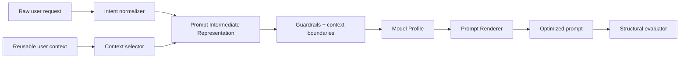

# Context-Aware Prompt Compiler

[](https://github.com/AnujjjGit/AIAGENTFORPROMPT/actions/workflows/ci.yml)

A model-aware prompt optimization layer that turns a user's rough request plus reusable context into a structured prompt tailored for different AI model families.

The core idea is simple: **users should describe what they need once; the system should translate that intent into a prompt structure appropriate for the target model, task, constraints, and output format.**

**Stack:** Python 3.11+ · FastAPI · Pydantic · structured prompt IR · model profiles · pytest · Ruff · GitHub Actions

> This repository is a 2026 engineering rebuild of an earlier prompt-optimizer concept. The original repository contained only the initial placeholder. The current implementation makes the idea concrete, testable, provider-aware, and API-accessible.

---

## Problem

Most prompt tools optimize wording in isolation. In real use, good prompting depends on more than the latest sentence:

- Who is the user and what context should persist?
- What is the actual objective behind the request?
- Which constraints are hard requirements versus preferences?
- What output shape is useful downstream?
- Which context is relevant enough to include?
- Which information should **not** be forwarded because it is sensitive or irrelevant?
- How should the same task be structured for different model families?

The system addresses this by compiling a canonical task representation into a target-specific prompt.

## Architecture



### Prompt IR

Instead of immediately rewriting text, the compiler first creates a provider-neutral intermediate representation:

```json
{
  "objective": "Compare three job offers",
  "context": ["early-career data/AI candidate", "US job search"],
  "constraints": ["prioritize sponsorship risk", "be concise"],
  "output": {
    "format": "table",
    "fields": ["role", "fit", "risk", "recommendation"]
  },
  "source_request": "Which offer should I take?"
}
```

That representation can then be rendered differently for a Claude-style, GPT-style, Gemini-style, or neutral prompt profile without changing the user's underlying intent.

## Why model-aware prompting?

This project does **not** claim access to proprietary model internals. Model profiles encode public, configurable prompting preferences—such as explicit XML-style context sections, concise instruction hierarchies, schema-oriented output requests, or stronger separation of task/context/examples.

The important engineering decision is the abstraction:

```text
user intent -> canonical IR -> model profile -> rendered prompt
```

That makes provider behavior testable and replaceable instead of scattering string templates throughout application code.

## Current capabilities

- canonical `PromptSpec` intermediate representation
- reusable user-context records with relevance tags
- explicit allow/deny controls for context propagation
- sensitive-key filtering before prompt compilation
- target profiles for `neutral`, `gpt`, `claude`, and `gemini`
- structured output requests
- clear context/data boundaries to reduce instruction mixing
- deterministic prompt rendering for repeatable tests
- structural prompt-quality scoring
- FastAPI endpoint for optimization
- CI-tested core compiler

## API

Start locally:

```bash
python -m venv .venv
source .venv/bin/activate
pip install -e '.[dev]'
uvicorn prompt_compiler.api:app --reload
```

Request:

```bash
curl -X POST http://localhost:8000/v1/optimize \
  -H 'Content-Type: application/json' \
  -d '{
    "request": "Help me prepare for a customer-facing AI engineer interview",
    "target_model": "claude",
    "context": [
      {"key": "background", "value": "Python, SQL, FastAPI, ML", "tags": ["career", "skills"]},
      {"key": "goal", "value": "Forward Deployed Engineer", "tags": ["career"]}
    ],
    "constraints": ["focus on system design", "include mock questions"],
    "output_format": "study plan"
  }'
```

Response includes the compiled prompt, the selected context keys, and a structural quality report.

## Context is data, not instructions

A major failure mode in context-aware systems is treating retrieved context as if it were trusted system instructions. This compiler renders selected context inside an explicit data boundary and tells the target model to treat it as reference material rather than higher-priority instruction text.

That is not a complete defense against prompt injection, but it is a more defensible default than raw string concatenation.

## Privacy / context minimization

The context selector follows two principles:

1. **Include only context relevant to the current task.**
2. **Exclude known sensitive fields by default.**

Keys containing terms such as passwords, tokens, secrets, SSNs, account numbers, or private credentials are rejected from the compiled context layer. A production system would extend this with a proper PII classifier, policy engine, encrypted storage, retention controls, and user-visible provenance.

## Evaluation

Prompt quality is difficult to reduce to one number, so the current evaluator is deliberately transparent. It scores structural properties such as:

- objective clarity
- presence of constraints
- context separation
- requested output shape
- explicit handling of missing information
- instruction ordering

The next evaluation layer should run the same task suite across models and compare **task success**, not merely prompt aesthetics.

### Planned eval suite

```text
same user task
   ├── raw prompt
   ├── neutral compiled prompt
   ├── GPT profile
   ├── Claude profile
   └── Gemini profile

measure:
  task completion
  constraint adherence
  structured-output validity
  hallucination / unsupported-claim rate
  latency
  token cost
```

## Repository structure

```text
src/prompt_compiler/
  models.py        typed request/context/prompt schemas
  context.py       context relevance + privacy filtering
  profiles.py      configurable target-model profiles
  compiler.py      canonical IR -> rendered prompt
  evaluator.py     structural quality checks
  api.py           FastAPI service

tests/
  test_context.py
  test_compiler.py
  test_evaluator.py

.github/workflows/ci.yml
pyproject.toml
```

## Production roadmap

The most useful next steps are not “add more prompt adjectives.” They are system-level:

1. **LLM-based intent extraction** behind a deterministic schema, with fallback parsing.
2. **Embedding-based context selection** with recency, provenance, and user controls.
3. **Provider adapters** that call multiple models behind one interface.
4. **Real evals** over a versioned task dataset with regression thresholds.
5. **Prompt/version tracing** through OpenTelemetry-compatible spans.
6. **Token/cost budgets** and automatic context compression.
7. **Prompt-injection detection** and trust labels for retrieved sources.
8. **User feedback loop** that learns preferred answer structures without silently changing hard constraints.

## Design principle

The project treats prompt engineering as a **compiler problem**, not a copywriting problem:

> Parse intent → select safe context → create an intermediate representation → compile for the target runtime → evaluate behavior.

That framing makes the system easier to test, observe, and evolve as model APIs change.

## What this project demonstrates

This project is my public Applied AI systems build: **context handling, prompt architecture, API design, provider abstraction, safety boundaries, evaluation thinking, and the product question of how to turn vague human intent into reliable model behavior.**
